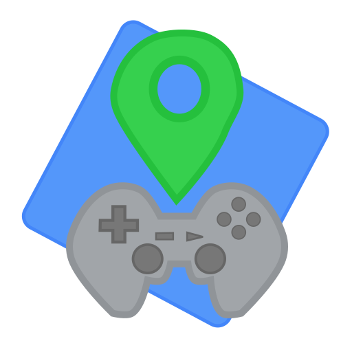

# Game Track - simple game tracker
Game track es una aplicacion de seguimiento de
progreso de juegos, pensada para todos aquellos
jugadores que quieran organizar su lista de videojuegos
en curso o proximos a jugar.

## Seguimiento de juegos
El seguimiento de juegos es manual, es decir,
el usuario registra los juegos que desea jugar y
va actualizando el estado de los mismos con forme
progrese en su avance.

Unicamente registra del juego su nombre, fecha que lo
inicio y el estatus (pendiente, en curso y terminado)
la aplicacion registra la fecha de termino cuando el 
estado pasa a terminado de forma automatica.

## Caracteristicas
- notificaciones push de estado de juego.
- base de datos local (sqlite) para historial de juegos.
- estadisticas mensuales de videojuegos.
- mas proximamente.
